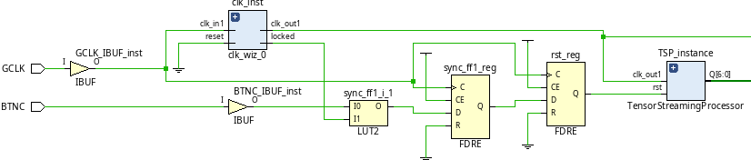
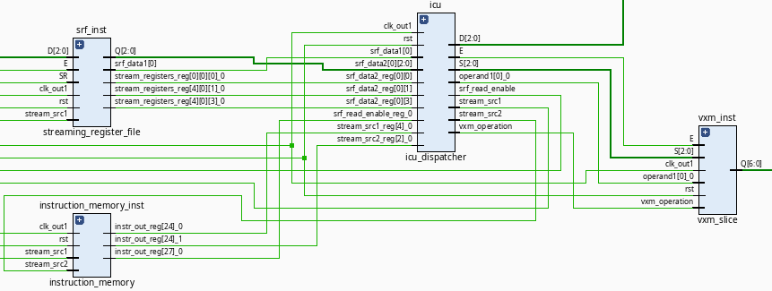
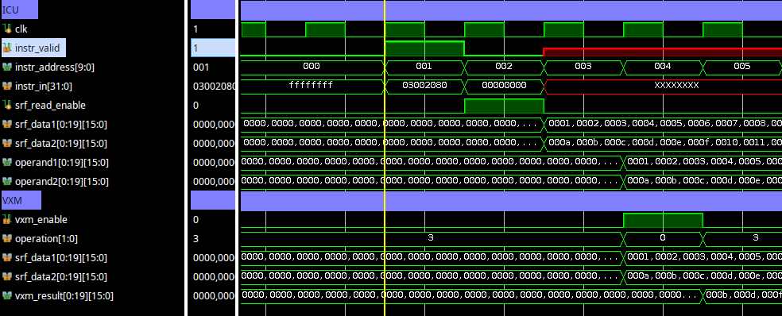

# Basic Design of the Tensor Streaming Processor

As mentioned in the "About" section on the project github page, TensorStreamingProcessor is inspired by Groq's 2020 "Think Fast" paper:

https://groq.com/groq-isca-paper-2020/

In this project, we of course can only implement a subset of the features, since we do not have all the details.  Nevertheless, the paper is
very well written to the point where we can implement the various submodules (ICU, VXM etc.) to the point of being able to understand Groq's unique
"software-defined hardware" approach.  The Tensor Streaming Processor design is also invaluable in understanding fundamental (digital) design and
architecture concepts such as clock domain crossings, pipelining and (AXI) protocol interfacing.

**Before** going through this document, **please read Groq's paper** to gather some fundamental ideas.  **It will be assumed that you have read the paper, before reading this (and other) documentation.**

## Block Diagram and Subsystems

Figure below shows the top level schematic from Vivado Synthesis (default settings).

We use the classic two stage synchronizer to ensure asynchronous BTNC (reset) is synchronized to a clock.  Figure below shows the TSP_instance.

To Be Completed

## Example Simulation

To appreciate Groq's approach, consider a simulation of a vector `add`: `ADD S0, S4, S8` below.

To Be Completed

## Timing Closure

Initially, we started with a global 100 MHz clock routed through a PLL clock buffer and BUFG, for timing closure and optimized pipeline.  Once we achieved optimal design and timing closure with a single clock domain, we then used the following clock domains:

1.  `clk_ctrl`: ICU Runs at 100 MHz
2.  `clk_mem`:  SRF and memory run at 200 MHz
3.  `clk_compute`:  VXM executes at full Zynq FPGA fabric speed - 300 MHz

To achieve timing closure, we will use the following solutions:

| Source Clock       | Destination Clock     | Solution, Justification               |
| -------------------|-----------------------|------------------------------------------|
| `clk_ctrl`(100 MHz)|`clk_compute` (300 MHz)| Async FIFO, multiple elements (bus)      |
| `clk_mem` (200 MHz)|`clk_compute` (300 MHz)| Async FIFO                               |
| `clk_ctrl`(100 MHz)|`clk_mem` (200 MHz)    | Dual Flip-Flop Synchronizer, handshaking |

To Be Completed

# Future Work

## Reducing the Number of Clock Cycles

As can be seen from the basic simulation of the vector `add`, the current behavior of the processor is:

- Cycle 1: Instruction is read, `srf_read_enable` is asserted.
- Cycle 2: Data is read from the SRF (due to 1-cycle read latency).
- Cycle 3: Data is registered into the operand pipeline.
- Cycle 4: VXM computes the result.
- Cycle 5: VXM result is registered and output.

Hence, the current **total latency is 4 clock cycles** after the instruction valid is asserted.

To reduce the latency, there are three options:

### Double Data Rate (DDR)

We can use **both rising and falling edges** and hence **halve the cycle time**.  We will perform a **read on the rising edge** and **compute on the falling edge**, thereby doubling throughput, but of course introducing complexity (e.g., needing dual-edge clocking for registers).

### Parallelize the SRF Read and Operand Pipeline Stage

We can of course register `operand1` and `operand2` directly when `srf_data` is valid.  That is, we can pipeline the data in
**cycle 2** instead of cycle 3.

This will result in a **latency of 3 clock cycles**.

### Use Classic Pipelining

That is, we overlap fetch and execution.  The first result will take 4 cycles, but **subsequent results should be generated every 1 cycle**.  However, one needs to be careful with this approach if we are accessing memory on the FPGA.

**Of the three approaches above, we will be pursuing the DDR approach, since execution per vector addition completes in 2 cycles, instead of 4.**

